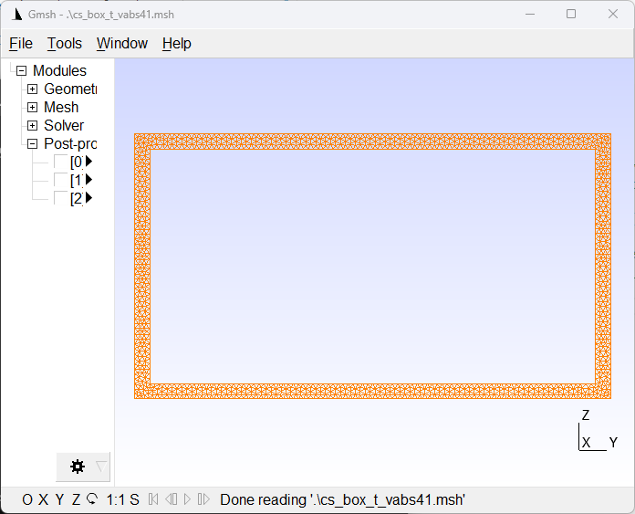

Convert Structure Gene Data
=============================

One of the main capabilities of SGIO is to convert Structure Gene data between different formats.
This can be done using the :func:`sgio.convert` function (API) or the ``sgio convert`` command (CLI).

Overview
--------

SGIO supports conversion between:

- **VABS** ↔ **SwiftComp** ↔ **Abaqus** ↔ **Gmsh**
- Mesh-only conversions for visualization
- Format version conversions (e.g., VABS 4.0 → 4.1)

Basic Usage
-----------

API Method
^^^^^^^^^^

..  code-block:: python

    import sgio

    sgio.convert(
        file_name_in='input.inp',
        file_name_out='output.sg',
        file_format_in='abaqus',
        file_format_out='vabs',
        model_type='BM2'
    )

CLI Method
^^^^^^^^^^

..  code-block:: bash

    sgio convert input.inp output.sg -ff abaqus -tf vabs -m BM2

Common Parameters
^^^^^^^^^^^^^^^^^

- ``file_name_in``: Input file path
- ``file_name_out``: Output file path
- ``file_format_in``: Input format (vabs, swiftcomp, abaqus, gmsh)
- ``file_format_out``: Output format
- ``model_type``: Structural model (BM1, BM2, PL1, PL2, SD1)
- ``mesh_only``: Convert mesh data only (default: False)
- ``renum_node``: Renumber nodes (default: False)
- ``renum_elem``: Renumber elements (default: False)

Common Conversion Scenarios
---------------------------

Scenario 1: VABS to Gmsh for Visualization
^^^^^^^^^^^^^^^^^^^^^^^^^^^^^^^^^^^^^^^^^^^

Convert a VABS cross-section to Gmsh format for visualization.

**API:**

..  literalinclude:: ../../../examples/convert_mesh_data_vabs2gmsh.py
    :language: python
    :lines: 1-30

**CLI:**

..  code-block:: bash

    sgio convert cs_box_t_vabs41.sg cs_box_t_vabs41.msh \
        -ff vabs -tf gmsh -m BM2 --mesh-only

**Result:**

    Box cross-section visualized in Gmsh

Scenario 2: Abaqus to VABS
^^^^^^^^^^^^^^^^^^^^^^^^^^^

Convert an Abaqus cross-section model to VABS input format.

**API:**

..  code-block:: python

    import sgio

    sgio.convert(
        'airfoil.inp',      # Abaqus input file
        'airfoil.sg',       # VABS output file
        'abaqus',           # Input format
        'vabs',             # Output format
        model_type='BM2'    # Timoshenko beam
    )

**CLI:**

..  code-block:: bash

    sgio convert airfoil.inp airfoil.sg -ff abaqus -tf vabs -m BM2

See ``examples/convert_abaqus_cs_to_vabs/`` for a complete example.

Scenario 3: Abaqus to SwiftComp (3D)
^^^^^^^^^^^^^^^^^^^^^^^^^^^^^^^^^^^^

Convert a 3D Abaqus model to SwiftComp format.

**API:**

..  code-block:: python

    import sgio

    sgio.convert(
        'cube.inp',         # Abaqus 3D model
        'cube.sg',          # SwiftComp output
        'abaqus',           # Input format
        'swiftcomp',        # Output format
        model_type='SD1',   # 3D solid model
        sgdim=3             # 3D structure gene
    )

**CLI:**

..  code-block:: bash

    sgio convert cube.inp cube.sg \
        -ff abaqus -tf swiftcomp -m SD1 --sgdim 3

See ``examples/convert_abaqus_sg3d_to_sc/`` for a complete example.

Scenario 4: Format Version Conversion
^^^^^^^^^^^^^^^^^^^^^^^^^^^^^^^^^^^^^^

Convert between different versions of the same format.

**VABS 4.0 to 4.1:**

..  code-block:: python

    import sgio

    sgio.convert(
        'old_format.sg',
        'new_format.sg',
        'vabs',
        'vabs',
        file_version_in='4.0',
        file_version_out='4.1',
        model_type='BM2'
    )

Scenario 5: Two-Step Conversion
^^^^^^^^^^^^^^^^^^^^^^^^^^^^^^^^

For more control, use separate read and write operations:

..  code-block:: python

    import sgio

    # Step 1: Read from Abaqus
    sg = sgio.read('model.inp', 'abaqus', model_type='BM2')

    # Inspect or modify the data
    print(f"Nodes: {len(sg.mesh.points)}")
    print(f"Elements: {len(sg.mesh.cells)}")

    # Step 2: Write to VABS
    sgio.write(sg, 'model.sg', 'vabs')

    # Step 3: Also export for visualization
    sgio.write(sg, 'model.msh', 'gmsh', mesh_only=True)

Advanced Options
----------------

Element and Node Renumbering
^^^^^^^^^^^^^^^^^^^^^^^^^^^^^

Renumber elements and nodes for cleaner output:

..  code-block:: python

    import sgio

    sgio.convert(
        'input.sg',
        'output.sg',
        'vabs',
        'vabs',
        renum_node=True,      # Renumber nodes sequentially
        renum_elem=True,      # Renumber elements sequentially
        model_type='BM2'
    )

Mesh-Only Conversion
^^^^^^^^^^^^^^^^^^^^

Convert only mesh data without materials:

..  code-block:: python

    import sgio

    sgio.convert(
        'input.sg',
        'output.msh',
        'vabs',
        'gmsh',
        mesh_only=True,
        model_type='BM2'
    )

Error Handling
^^^^^^^^^^^^^^

Always check for file existence and handle errors:

..  code-block:: python

    import sgio
    from pathlib import Path

    input_file = Path('input.inp')
    output_file = Path('output.sg')

    if not input_file.exists():
        print(f"Error: Input file not found: {input_file}")
        exit(1)

    try:
        sgio.convert(
            str(input_file),
            str(output_file),
            'abaqus',
            'vabs',
            model_type='BM2'
        )
        print(f"✓ Conversion successful: {output_file}")
    except Exception as e:
        print(f"✗ Conversion failed: {e}")

Tips and Best Practices
------------------------

1. **Always specify model_type**: Required for proper data interpretation
2. **Use mesh_only for visualization**: Faster and simpler for viewing geometry
3. **Check input files first**: Verify files exist before conversion
4. **Use renumbering for clean output**: Helps with debugging and analysis
5. **Test with small models first**: Verify conversion works before processing large files

Troubleshooting
---------------

**Issue: "File not found" error**
  - Check file path is correct (absolute or relative to working directory)
  - Verify file exists using ``Path(filename).exists()``

**Issue: "Unknown file format" error**
  - Check format string is correct (vabs, swiftcomp, abaqus, gmsh)
  - Verify file extension matches format

**Issue: Conversion produces empty file**
  - Check model_type is specified correctly
  - Verify input file contains valid data
  - Try mesh_only=True to isolate material issues

**Issue: Material properties lost**
  - Don't use mesh_only=True if you need materials
  - Some formats (Gmsh) don't support full material data

See Also
--------

- :doc:`io` - Detailed I/O documentation
- :doc:`io_model` - Reading analysis output
- `Examples <../../../examples/>`_ - Working code examples
- `Test Suite <../../../tests/>`_ - Comprehensive test cases

Notes
-----

..  note::

    Gmsh and ParaView are not included in SGIO.
    Install them separately for visualization:

    - Gmsh: https://gmsh.info/
    - ParaView: https://www.paraview.org/
