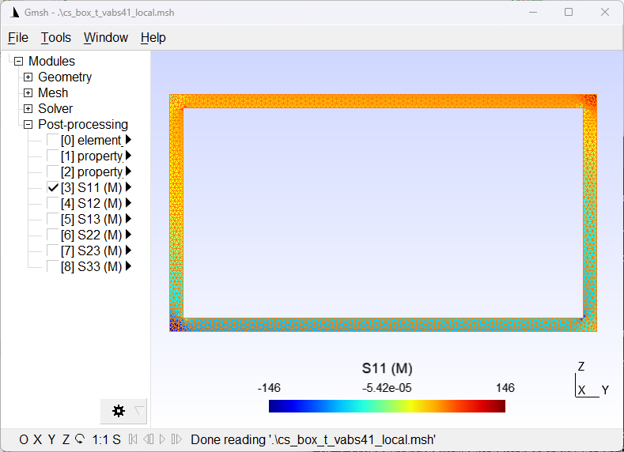

Read Local States
==================

After dehomogenization and/or failure analysis, local state fields (strain/stress/displacement/failure index/strength ratio) of the SG can be read using the :func:`sgio.readOutputState` function.

Read VABS Element Local Strain and Stress Fields and Visualize in Gmsh
-----------------------------------------------------------------------

Consider the following VABS output file (``sgio/examples/files/cs_box_t_vabs41.sg.ELE``) after dehomogenization.
This file contains the local strains and stresses of each element of the cross-section, in both the global and material coordinate systems.

..  literalinclude:: ../../../examples/files/cs_box_t_vabs41.sg.ELE
    :language: text
    :lines: 1-10

To read the data, we need to read the cross-sectional data using :func:`sgio.read` and then read the local state fields using :func:`sgio.readOutputState`.

..  literalinclude:: ../../../examples/read_vabs_output_d.py
    :language: python
    :start-after: step1
    :end-before: step2

Then, we need to add the local state fields to the cross-sectional data.

..  literalinclude:: ../../../examples/read_vabs_output_d.py
    :language: python
    :start-after: step2
    :end-before: step3

Finally, we need to write the cross-sectional data to a Gmsh file.

..  literalinclude:: ../../../examples/read_vabs_output_d.py
    :language: python
    :start-after: step3

The following figure shows the visualization of the local stress field of the cross-section in the material coordinate system.

