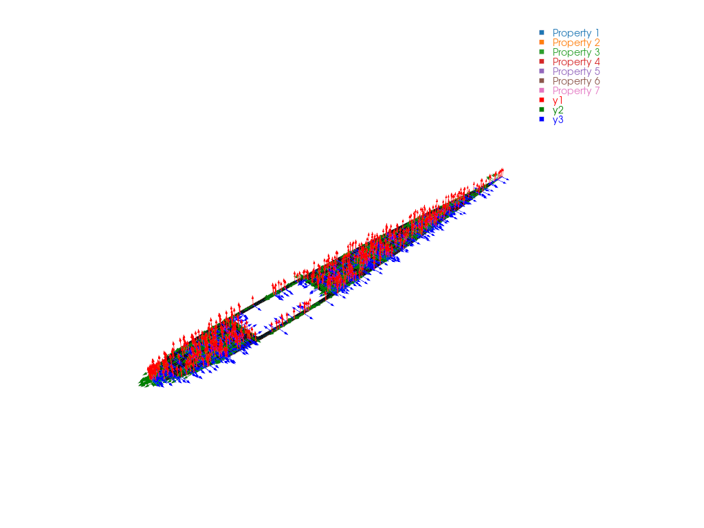

# Convert Abaqus Cross-Section to VABS

## Problem Description

Given a 2D beam cross-section mesh created in Abaqus (`.inp` format), convert it to a VABS input file for beam property homogenization using the Timoshenko beam model.

## Solution

The `.inp` file does not state the SG parameters `sgdim`, `model_type` and
`model_space`. There are two ways to supply them, one script each; both write
the same VABS input.

`model_type='BM2'` selects the Timoshenko beam model (includes shear
deformation). Use `'BM1'` for the classical Euler-Bernoulli model.

### Method 1: API arguments

The SG parameters are arguments of {func}`sgio.convert`.

<!-- code: run_1_api.py -->

### Method 2: SG manifest

`sg2_airfoil.sg.json` (see {doc}`/ref/sg_manifest`) references the `.inp` file
and holds the same parameters, so the conversion takes no SG arguments:

<!-- code: sg2_airfoil.sg.json -->

<!-- code: run_2_manifest.py -->

This script also writes the section as a Gmsh mesh `main.msh` with its manifest
`main.sg.json`. A `.msh` file holds no materials or SG parameters, so a Gmsh
export is always written through a manifest.

## Result

A VABS input file `sg2_airfoil.sg` is written to the example directory and can be passed directly to VABS for homogenization.

To inspect the Abaqus mesh and its per-element material directions before
homogenization, see {doc}`plot_abaqus_local_csys`.

## File List

- [run_1_api.py](run_1_api.py): Conversion with SG arguments
- [run_2_manifest.py](run_2_manifest.py): Conversion through the SG manifest
- [sg2_airfoil.inp](sg2_airfoil.inp): Abaqus cross-section input file
- [sg2_airfoil.sg.json](sg2_airfoil.sg.json): SG manifest for the Abaqus input
- [pyvista.png](pyvista.png): PyVista mesh and local-axis preview
