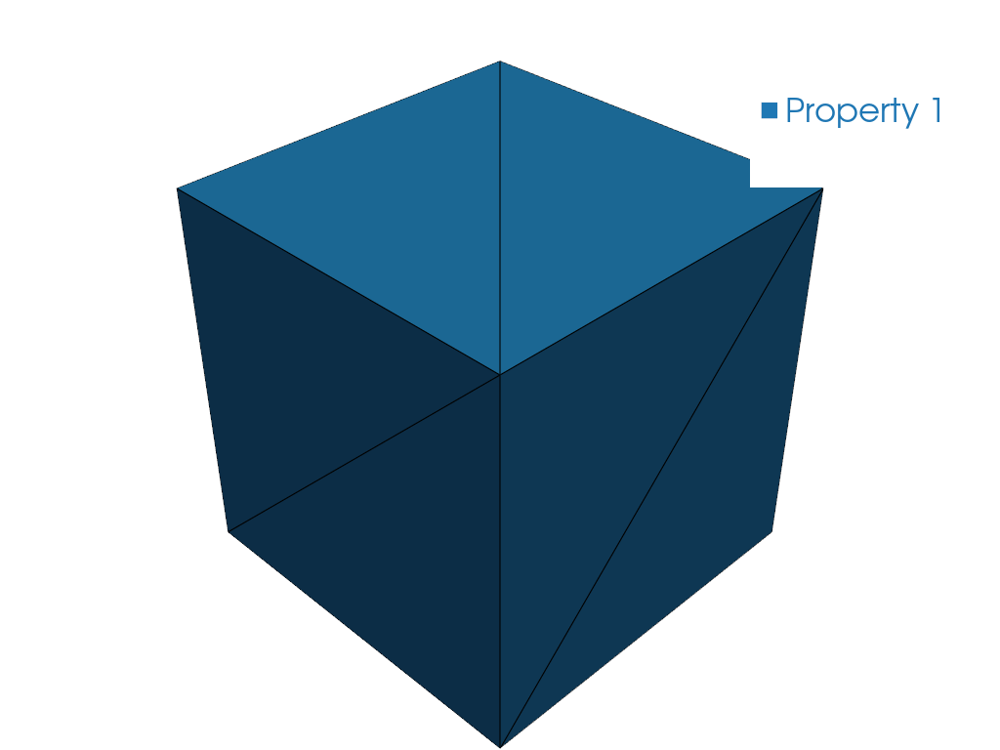

# Convert Gmsh Mesh to SwiftComp

## Problem Description

Given a 3D tetrahedral mesh generated in Gmsh (`.msh` format), convert it to a
SwiftComp input file for 3D solid homogenization.

## Solution

The mesh alone does not carry materials or analysis settings, so the example
uses an **SG manifest**: `sg33_cube_tetra4_min_gmsh41.sg.json` references the
`.msh` file and supplies `sgdim`, the model type, the analysis configuration,
the materials, and the sections that bind physical groups to them. See
{doc}`/ref/sg_manifest`.

<!-- code: run.py -->

{func}`sgio.read` with `'sg_manifest'` assembles the manifest and the mesh into a
{class}`sgio.StructureGene`; the manifest's `model_type` `SD1` selects the 3D
solid model.
{func}`sgio.write` then emits SwiftComp 2.1 input.

## Result

A SwiftComp 2.1 input file `sg33_cube_tetra4_min_gmsh41.sg` is written and ready for homogenization.

## File List

- [run.py](run.py): Main Python script
- [sg33_cube_tetra4_min_gmsh41.msh](sg33_cube_tetra4_min_gmsh41.msh): Gmsh mesh file
- [sg33_cube_tetra4_min_gmsh41.sg.json](sg33_cube_tetra4_min_gmsh41.sg.json): SG manifest
- [pyvista.png](pyvista.png): PyVista mesh preview
