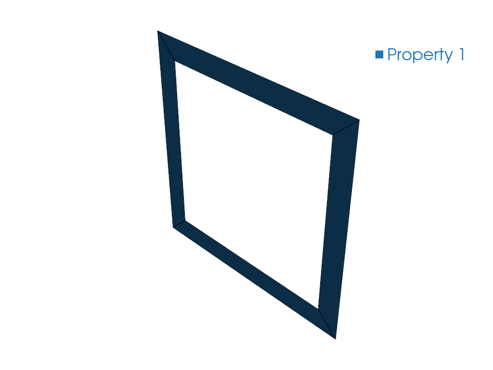

# Convert a Gmsh Mesh to VABS

## Problem Description

An external CAD + Gmsh workflow produces a 2D section mesh. Convert it into a
VABS input file, with materials and analysis settings supplied alongside the
mesh.

## Solution

The example uses an **SG manifest** (see {doc}`/ref/sg_manifest`):

- `sg21_box_quad4_min_gmsh41.msh` — the section mesh and its physical groups
- `sg21_box_quad4_min_gmsh41.sg.json` — the manifest referencing the mesh, with
  `sgdim`, model type, model space, analysis configuration, materials and
  sections

<!-- code: run.py -->

{func}`sgio.read` with `'sg_manifest'` reads the manifest and the mesh into a
{class}`sgio.StructureGene`, which {func}`sgio.write` then emits as VABS input.
This is the recommended path for external CAD + Gmsh workflows.

## Result

`sg21_box_quad4_min_gmsh41.sg` is written, ready for VABS.

```bash
uv run python examples/convert_gmsh_to_vabs/run.py
```



## File List

- [run.py](run.py): Main Python script
- [sg21_box_quad4_min_gmsh41.msh](sg21_box_quad4_min_gmsh41.msh): Gmsh section mesh
- [sg21_box_quad4_min_gmsh41.sg.json](sg21_box_quad4_min_gmsh41.sg.json): SG manifest
- [sg21_box_quad4_min_gmsh41.sg](sg21_box_quad4_min_gmsh41.sg): Generated VABS input
- [pyvista.png](pyvista.png): PyVista mesh preview
