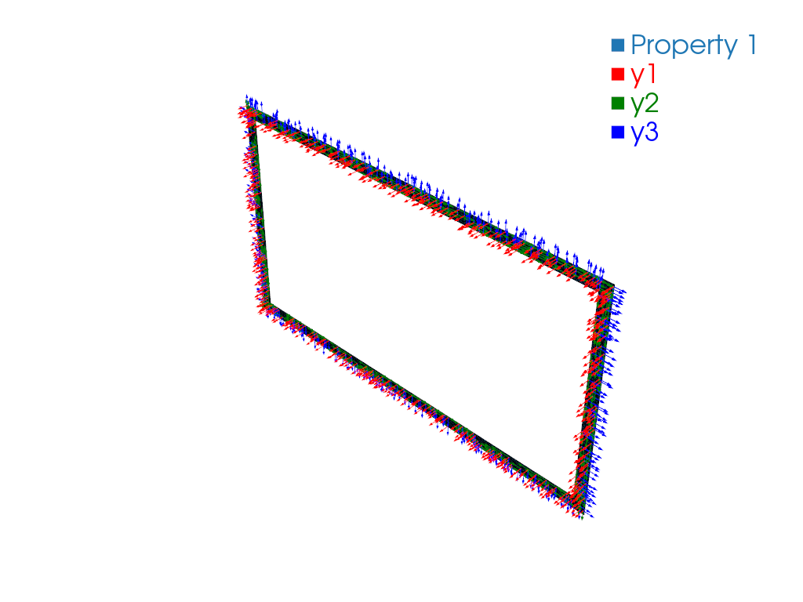

# Convert VABS Cross-Section Mesh to Gmsh

## Problem Description

Given a VABS cross-section file, export it as a Gmsh mesh for inspection,
visualization or Gmsh-based workflows, without losing the materials and SG
parameters the mesh cannot hold.

## Solution

<!-- code: run.py -->

{func}`sgio.write` with `'sg_manifest'` writes the Gmsh model file `main.msh`
and the SG manifest `main.sg.json` that references it. The manifest carries
`sgdim`, model type, model space, analysis configuration, materials and
sections; see {doc}`/ref/sg_manifest`.

## Result

`main.msh` opens in Gmsh or ParaView:

```bash
gmsh main.msh
```

`sgio.read('main.sg.json', 'sg_manifest')` reads the full structure gene back.



## File List

- [run.py](run.py): Main Python script
- [cs_box_t_vabs41.sg](cs_box_t_vabs41.sg): VABS input
- [main.msh](main.msh): Generated Gmsh mesh
- [main.sg.json](main.sg.json): Generated SG manifest
- [pyvista.png](pyvista.png): PyVista mesh preview
